# NeuroProject

**Назначение**

Данная программа предназначена для создания и обучения многослойных полносвязных нейронных сетей прямого распространения. Основные области применения таких нейронных сетей обширны:

-   Прогнозирование временных рядов

-   Задачи классификации

-   Модели принятия решений

-   Модели управления техникой

-   Аппроксимация функций

-   Очистка сигнала от шумов (шумоподавление)

-   Распознавание рукописных букв, символов

-   Ассоциативный поиск

-   Сжатие информации

-   Кодирование/декодирование информации

-   Выявление значимых факторов.

Возможности (характеристики) программы состоят в следующем:

-   Каждый последующий слой нейронов связан с предыдущим.

-   Каждый слой содержит матрицу весов нейронов и вектор смещений. Все операции с сетью – это операции с матрицами и векторами.
    
-   Каждый нейрон имеет свою функцию активации и 1 гиперпараметр для неё.
    
-   Возможна случайная инициализация весов сети с помощью алгоритма Нгуен-Видроу, либо обычная случайная инициализация весов в заданном диапазоне.
    
-   В качестве алгоритма обучения используется алгоритм обратного распространения ошибки (backpropagation) с регуляризацией, коэффициентом инерции и автоадаптацией скорости обучения.
    
-   Возможность дообучения уже готовой нейросети.

-   Возможность использовать систему предотвращения переобучения dropout.
    
-   Есть механизм блокировки весов отдельных нейронов от изменения при обучении.
    
-   Есть возможность использования 2 целевых функций: MSE – среднеквадратичная ошибка, Cross – кросс-энтропия.
    
-   Возможность использовать Softmax для выходного слоя для задач классификации.
    
-   Есть встроенный генератор случайных данных, распределённых равномерно в заданном диапазоне.
    
-   Встроенный преобразователь для выходных данных softmax: номер класса → вектор → номер класса (one-hot encoding).
    
-   Есть возможность использования фильтрации данных на выходном слое нейросети.
    
-   Хранение и сериализация данных осуществляется с помощью формата ECSV (Extended Comma-Separated Values).
    
-   Механизм представления данных обучающих примеров для использования их несколькими нейросетями (параметр shiftout), когда входные данные одинаковы, а выходные вектора разные.
    
-   Использование тестового множества для оценки обучения.

-   Случайное перемешивание примеров в обучающем и тестовом множествах.

-   Имеется механизм для обучения нейросети на временных последовательностях.
    
-   Множественное обучение нейросети, т.е. возможность обучать нейросеть заданное количество раз на разных (или пересекающихся) примерах. Здесь также возможно дообучение сети.

 

**Пользовательский интерфейс**

Программа написана на языке C++ на платформе Qt Creator 3.0.1 (библиотека Qt 5.2.1). Возможно также нетрудное портирование кода программы и на другие платформы/библиотеки.

Окно программы выполнено в минималистичном виде (см. рисунок ниже). Идея работы программы проста – все входные и выходные данные хранятся в файлах, программа осуществляет лишь их преобразование. В графическом окне программы выводится лишь общая информация (общие логи), всё управление осуществляется несколькими кнопками.

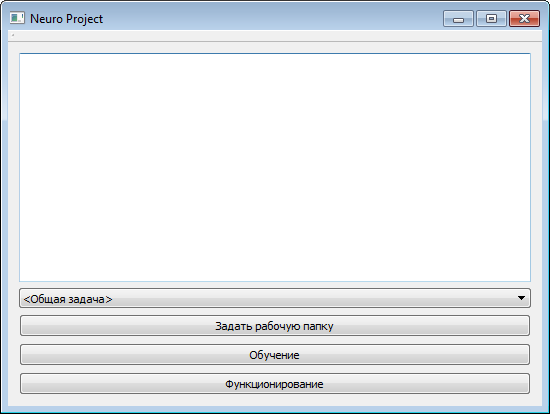{width="550" height="414"}

*Рис. 1.* Окно программы NeuroProject.

 

Элементы интерфейса программы:

-   Текстовое поле – Используется для вывода логов.

-   Поле выбора задачи – Специализация программы под конкретную задачу:

    -   *\<Общая задача\>* – Применение нейросети под любую задачу.

    -   *Trade* – Применение нейросети для предсказания временных рядов. По данному типу задачи пример для обучения - *trade_test* (подробнее смотрите описание к нему).
    
-   Кнопка *«Задать рабочую папку»* – Задаётся папка, в которой хранятся конфигурационные файлы нейронной сети и файлы с данными по задаче.
    
-   Кнопка *«Обучение»* - Запуск обучения нейронной сети. При этом данные для обучения считываются из файлов:
    
-   В первую очередь из *in\_examples, in\_neuronet, in\_trainbp*.
        
    -   Если файл *in\_examples* не был найден, то чтение производится из *out\_examples*.
    
-   Кнопка *«Функционирование»* - Запуск нейросети в режиме функционирования. При этом данные читаются из файлов:
    -   В первую очередь из *in\_examples, out\_neuronet.*
    
    -   Если файлы не были найдены, то чтение осуществляется из *out\_examples, in\_neuronet*.

 

**Общий алгоритм действий, используемые/создаваемые файлы**

Для обучения/функционирования нейронной сети используются следующие входные файлы:

-   *in\_examples.txt* – Параметры и данные для обучения/функционирования нейронной сети. Здесь указываются примеры, а также производится деление примеров на обучающее, тестовое и валидационное множества.
    
-   *in\_neuronet.txt* – Параметры модели нейронной сети. Здесь можно указать структуру нейросети для её обучения, либо предопределённую нейросеть уже с готовыми весами.
    
-   *in\_trainbp.txt* – Параметры обучения построенной модели. Для алгоритма обучения нейросети указываются параметры этого обучения и указываются условия для прекращения процесса обучения.

Выходные данные после обучения/функционирования нейросети сохраняются в файлы:

-   *out\_examples.csv* – Здесь сохраняются выходные данные, полученные после функционирования нейросети (вектор *outrun*) и постобработки выходных данных (вектор *outpostrun*).
    
-   *out\_neuronet.csv* – В этом файле хранится полученная структура, веса и смещения нейросети.
    
-   *out\_trainbp.csv* – Параметры, полученные после обучения нейросети. Также сюда записывается информация об изменении весов и энергии нейросети во время обучения. Данный файл используется для оценки модели нейросети и далее импортируется в файл MS Excel *«Энергия обучения»*.

Порядок загрузки данных при обучении:

-   *in\_examples*, иначе *out\_examples*
    
-   *in\_neuronet*

-   *in\_trainbp*.

Записываемые при этом файлы: *out\_examples, out\_neuronet,
out\_trainbp.*

Порядок загрузки данных при функционировании:

-   *in\_examples*, иначе *out\_examples*
    
-   *out\_neuronet,* иначе *in\_neuronet.*

Записываемые при этом файлы: *out\_examples*, *out\_neuronet*.

Мы рассмотрим общий алгоритм действий при обучении/функционировании нейронной сети в решении поставленной задачи (см. рисунок ниже):

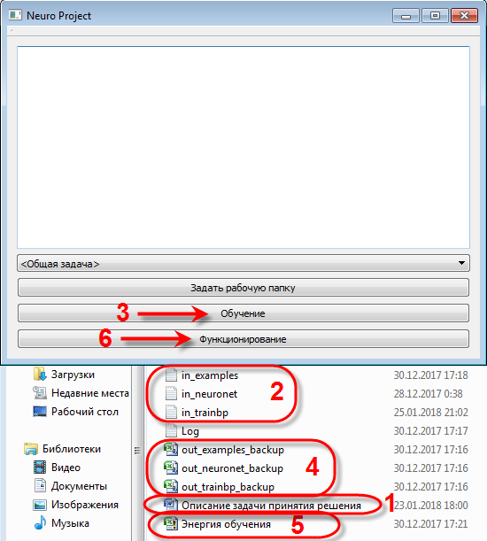{width="550" height="611"}

*Рис. 2.* Порядок работы с NeuroProject.

 

1.  Составить описание и техническое задание решаемой задачи. По желанию можно воспользоваться для этого готовым шаблоном (папка в проекте *«Шаблон»*).
    
2.  Подготовить входные файлы с параметрами и данные для обучения: *in\_examples*, *in\_neuronet*, *in\_trainbp*.
    
3.  Нажать кнопку *«Обучение»* для запуска процесса обучения. В процессе обучения рассчитываются выходы/энергия для обучающего и тестового множества примеров.
    
4.  Проанализировать полученные результаты можно, открыв файлы *out\_examples* и *out\_trainbp*. При необходимости можно сохранить полученные результаты обучения, переименовав выходные файлы.
    
5.  Графически проследить за процессом обучения можно, загрузив файл *out\_trainbp* в файл *«Энергия обучения.xlsx»*.
    
6.  Нажать на кнопку *«Функционирование»* для проверки работы нейросети на валидационном множестве примеров.
    
7.  Проанализировать полученные результаты можно, открыв файл *out\_examples*.
    
     

**Описание параметров файла in\_examples**

Теперь приступим к описанию параметров каждого конфигурационного файла для обучения и функционирования нейронной сети.

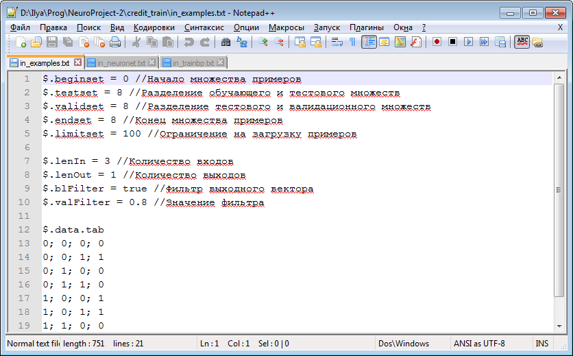{width="643" height="399"}

*Рис. 3.* Файл in\_examples.txt.

 

В файле *in\_examples* хранятся данные для обучения в виде примеров. Всё множество примеров разделено на:

-   Обучающее множество – Используется во время обучения нейросети для снижения ошибки целевой функции.
    
-   Тестовое множество – Используется во время обучения для независимой оценки качества работы нейросети.
    
-   Валидационное множество – Используется в режиме функционирования нейронной сети в реальных условиях для выдачи готового результата. При этом выходной вектор данных можно не определять.

Общие параметры файла:

-   ***beginset*** – Индекс начала множества примеров. Минимальный индекс = 0.
    
-   ***testset*** – Индекс разделения обучающего и тестового множеств. Находится между *beginset* и *validset*.
    
-   ***validset*** – Индекс разделения тестового и валидационного множеств. Находится между *testset* и *endset*.
    
-   ***endset*** – Индекс конца множества примеров. Максимальный индекс = Общее количество примеров.
    
-   ***limitset*** – Ограничитель на загрузку примеров в программу. Если *limitset = 0*, то загружаются все примеры. Не может быть меньше *endset*.
    
-   ***lenIn*** – Количество входов для нейронной сети.

-   ***lenOut*** – Количество выходов для нейронной сети.

-   ***blClearTypeSet*** – Очищать тип примера при перемещении окна обучения (значение true/false)?
    
-   ***typeNormIn*** – Задаёт тип нормализации входа. Может принимать следующие значения:
    -   *Linear* – Линейная нормализация.

    -   *SoftStep* – Нормализация логистической функцией в пределах (0; 1).
    
    -   *Arctg* – Нормализация функцией *Arctg* в пределах (-π/2; +π/2).
    
-   *Gaussian* – Нормализация функцией Гаусса.
    
-   ***inMin*** – Значение минимума входа.

-   ***inMax*** – Значение максимума входа.

-   ***inKoef*** – Коэффициент входа выступает в качестве параметра для функции нормализации.
    
-   ***typeNormOut*** – Задаёт тип нормализации выхода (см. typeNormIn).
    
-   ***outMin*** – Значение минимума выхода.

-   ***outMax*** – Значение максимума выхода.

-   ***outKoef*** – Коэффициент выхода выступает в качестве параметра для функции нормализации.
    
-   ***lenRand*** – Количество случайных примеров, которые добавляются в конец всех примеров.
    
-   ***lenClass*** – Количество классов, которое используется на выходе нейронной сети. Параметр нужен для определения классификационных выборок.
    
-   ***blClass*** – Нужно ли преобразовывать номер класса на выходе нейросети в вектор (значение true/false)?
    
-   ***blFilter*** – Применение фильтра выходного вектора (значение true/false).
    
-   ***valFilter*** – Значение фильтра для выходов нейросети.
-   Если выход положительный и он больше значения фильтра, то выход принимается за 1, иначе за 0.
        
    -   Если выход отрицательный и он меньше значения фильтра, то выход принимается за -1, иначе за 0.

-   ***sizeClass*** – Размер класса для выравнивания обучающей выборки. Этот параметр определяет какого размера нужно использовать класс для обучения. Если *sizeClass = 0*, то данный функционал отключён.

Параметры для задачи **Trade**:

-   ***period*** – Значение периода агрегации баров. По умолчанию *period = 1*. Этот параметр задаёт количество баров малого периода (загружаемые из файла *bars.csv*), из которых строятся бары большего периода. К примеру, изначально мы подготовили файл с данными по барам периода M5 (5 минут). Для того, чтобы из этих баров построить бары большего периода H1 (1 час), в параметре указываем *period = 12* (60 минут / 5 минут = 12 периодов).
-   ***koefTg*** – Количество пунктов в цене. Для большинства валютных пар *koefTg = 10000*.
-   ***koefPrice*** – Коэффициент преобразования цены. Формула для предобработки следующая: 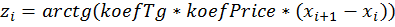, где 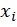 – это исходная цена.
    
-   ***koefVolume*** – Коэффициент преобразования объёма. Формула для предобработки следующая: 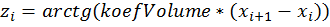, где  – это исходный объём.
-   ***lenInBar*** – Количество входных баров. Количество входов для нейросети вычисляется так: *lenIn* = *lenInBar* \* 4.

 

**Описание параметров файла in\_neuronet**

{width="643" height="399"}

*Рис. 4.* Файл in\_neuronet.txt.

 

Общие параметры файла:

-   ***typeLay*** – Массив типов слоёв нейросети. Тип слоя назван по используемой функции активации в слое. Если нейроны в слое имеют разные функции активации, то необходимо указать тип слоя *None*. Существуют следующие типы слоёв/нейронов (см. Приложение 1).
    
-   ***lenNeurons*** – Количество нейронов в каждом слое, включая входной.
    
-   ***lock*** – Маска для блокировки нейронов от изменения (значение 0/1). Нейроны идут здесь по порядку. Заблокированный нейрон не изменяет свои веса и смещение при обучении.
    
-   ***blLock*** – Выключатель блокировки нейронов для нейросети в целом (значение true/false). Если *blLock* *=* *false*, то массив *lock* не действует.
    
-   ***koefLay*** – Коэффициенты слоёв, т.е. гиперпараметр для функции активации слоя. По умолчанию каждый коэффициент инициализируется в зависимости от используемой функции активации.
    
-   ***dropout*** – Параметр выключения нейронов *dropout*. Это алгоритм для предотвращения переобучения нейросети. *Dropout* выключает нейроны случайным образом с заданной вероятностью (значения вероятности изменяются в пределах от 0 до 1).
    
-   ***valueWeight*** – Параметр инициализации весов. Веса инициализируются случайным образом в определённых пределах, который зависит в свою очередь от этого параметра.
    
-   ***shiftout*** – Смещение выходного вектора примеров для нейросети. По умолчанию *shiftout = 0*.
    
-   ***typeInit*** – Тип инициализации весов и смещений нейросети.
    Существуют следующие типы инициализации:
-   *None* – Без инициализации.
    
-   *Empty* – Инициализация случайным образом весов и смещений в пределах (-*valueWeight*; +*valueWeight*).
        
    -   *InitG* – Инициализация методом Нгуен-Видроу.

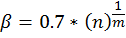

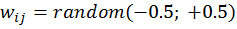

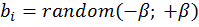

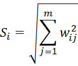

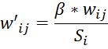

*n* – Количество нейронов в текущем слое

*m* – Количество нейронов в предыдущем слое.

- ***typeTarget*** – Вид целевой функции. Существуют следующие функции:

  | Тип   | Название                  | Функция                     | Производная                 |
  | ----- | ------------------------- | --------------------------- | --------------------------- |
  | None  | Нет целевой функции       |                             |                             |
  | MSE   | Среднеквадратичная ошибка | 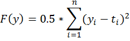 | 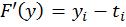 |
  | Cross | Кросс-энтропия            |  |  |

  

**Описание параметров файла in\_trainbp**

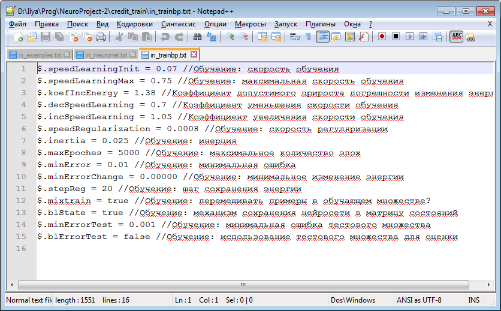{width="643" height="399"}

*Рис 5.* Файл in\_trainbp.txt.

В файле *in\_trainbp* хранится информация об алгоритме обучения нейронной сети. В частности, это алгоритм обратного распространения ошибки. Общая формула изменения весов сети выглядит следующим образом (см. Приложение 2).

Общие параметры файла:

-   ***speedLearningInit*** - Начальная скорость
    обучения. Изменяется в пределах от 0 до 1. Текущая скорость обучения
    *speedLearning* не может быть больше *speedLearningMax*.

-   ***speedLearningMax*** - Максимальная скорость обучения. Нужна для
    ограничения автоматической подстройки коэффициента обучения.
    Изменяется в пределах от 0 до 1.

-   ***koefIncEnergy*** - Коэффициент допустимого
    прироста погрешности изменения энергии. Значение всегда больше 1.
    Алгоритм изменения коэффициента обучения работает по следующей
    формуле (см. Приложение 2).

-   ***decSpeedLearning*** - Коэффициент уменьшения
    скорости обучения. Значение находится в пределах от 0 до 1.

-   ***incSpeedLearning*** - Коэффициент увеличения
    скорости обучения. Значение всегда больше 1.

-   ***speedRegularization*** - Скорость регуляризации.
    Этот коэффициент используется при обучении для предотвращения
    переобучения.

Сама энергия регуляризации же рассчитывается по следующей формуле
(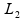-регуляризация): 

Где *K* – число слоёв в сети, *n* и *m* – количество нейронов в соответствующем слое.

*W* – это матрица весов, *B* – матрица смещений.

-   ***inertia*** – Коэффициент инерции. Используется для создания эффекта инерционности при перемещении градиента.
    
-   ***maxEpoches*** – Максимальное количество эпох обучения. Используется в качестве условия для остановки обучения.
    
-   ***minError*** – Минимальная ошибка обучения. Используется в качестве условия для остановки обучения.
    
-   ***minErrorChange*** – Минимальное изменение энергии. Используется в качестве условия для остановки обучения.
    
-   ***stepReg*** – Шаг сохранения энергии. Энергия обучающего и тестового множества, а также снимок нейросети будут сохраняться каждые *stepReg* эпох. Если *stepReg = 0,* то такая информация сохраняться не будет.
    
-   ***mixtrain*** – Перемешивать примеры в обучающем множестве в процессе обучения (значение true/false)? Если *mixtrain = true*, то очередной обучающий пример будет браться из множества случайным образом.
    
-   ***mixtest*** – Перемешать тестовые примеры с обучающими перед обучением (значение true/false)?
    
-   ***blState*** – Механизм сохранения нейросети в матрицу состояний (значение true/false). Этот параметр действует совместно со *stepReg*.
    
-   ***minErrorTest*** – Минимальная ошибка тестового множества. Используется в качестве условия для остановки обучения.
    
-   ***blErrorTest*** – Использование тестового множества для оценки в процессе обучения (значение true/false).
    
-   ***blDropout*** – Использование при обучении dropout (значение true/false).
    
-   ***stepDropout*** – Шаг изменения dropout задаёт количество эпох, за которое происходит изменение текущей подсети для обучения.
    
-   ***blDropoutExm*** – Использование dropout для каждого примера в отдельности в рамках выполнения текущей эпохи обучения (значение true/false). Установка этого параметра отменяет предыдущий stepDropout.

 

**Анализ данных выходных файлов**

{width="643" height="480"}

*Рис. 6.* Файл out_trainbp.csv, открытый в MS Excel.

 

После обучения/функционирования нейросети в рабочей папке появляются файлы, данные из которых доступны для анализа. Выходные файлы с расширением *\*.csv* можно открыть или импортировать в стороннюю программу, например в MS Excel, где затем можно извлекать из них данные для последующих вычислений и построения графиков. Рассмотрим ключевые (не все) параметры для анализа по файлам.

Параметры файла out_examples:

-   ***data.input*** – Входные (уже нормализованные/предобработанные) данные для нейросети.
    
-   ***data.output*** – Выходные (также нормализованные/предобработанные) эталонные данные для обучения нейросети.
    
-   ***data.outrun*** – Выходные расчётные данные нейросети.
    
-   ***data.outpostrun*** – Данные, полученные из выходных расчётных данных после постобработки.

Параметры файла out\_neuronet:

-   ***lay.weigth*** – Веса соответствующего слоя нейронной сети.
    
-   ***lay.bias*** – Смещения соответствующего слоя нейронной сети.

Параметры файла out\_trainbp:

-   ***energyAver*** – Рассчитанная средняя энергия обучающего множества примеров. Шаг сохранения энергии задан параметром *stepReg*.
    
-   ***energyMax*** – Рассчитанная максимальная энергия обучающего множества примеров. Шаг сохранения энергии задан  параметром *stepReg*.
    
-   ***energyTestAver*** – Рассчитанная средняя энергия тестового множества примеров. Шаг сохранения энергии задан параметром *stepReg*.
    
-   ***energyTestMax*** – Рассчитанная максимальная энергия тестового множества примеров. Шаг сохранения энергии задан  параметром *stepReg*.
    
-   ***speedLearningHistory*** – Текущий коэффициент скорости обучения. Шаг сохранения коэффициента задан параметром *stepReg*.
    
-   ***state*** – Снимок (веса и смещения) нейросети на текущей итерации. Шаг сохранения снимка задан параметром *stepReg*.

Кроме всего прочего, из выходных файлов можно импортировать данные в MS Excel. Как это сделать рассмотрим ниже.

В первую очередь, необходимо выбрать системный разделитель дробной части – точку. В программе заходим: *Главное меню Excel – Параметры Excel*

{width="347" height="40"}

*Рис. 7.* Параметры Excel в меню.

 

На вкладке *«Дополнительно»* в качестве разделителя задаём точку. Если будет задан другой разделитель, при импорте данных MS Excel распознает числа как строки.

Затем импортируем данные из текстового файла: *Меню Данные – Получить внешние данные – Из текста*.

 

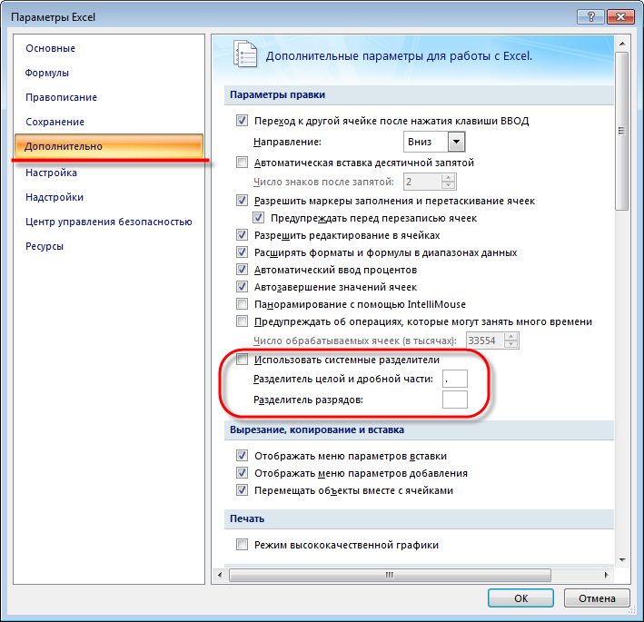{width="643" height="621"}

*Рис. 8.* Изменение системного разделителя дробной части.

{width="643" height="228"}

*Рис. 9.* Импорт внешних данных из текста.

 

Выбираем нужный нам файл и нажимаем кнопку *«Импорт»*.

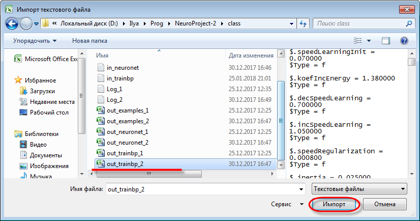{width="643" height="338"}

*Рис. 10.* Выбор файла для импорта.

 

Запускается мастер текстов. Указываем параметры как на скриншоте.

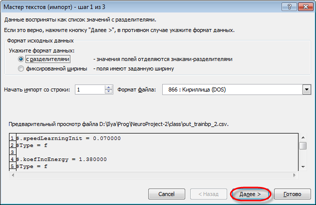{width="617" height="400"}

*Рис. 11.* Мастер текстов, шаг 1.

 

В качестве символа-разделителя выбираем точку с запятой (;) и знак равно (=), указываем ограничитель строк.

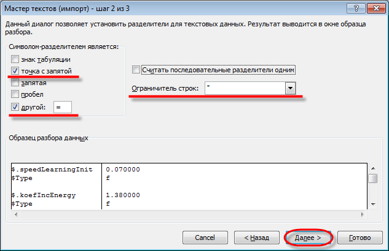{width="624" height="404"}

*Рис. 12.* Мастер текстов, шаг 2.

 

На этом шаге можно указать формат каждого столбца таблицы: общий, текстовый, либо дата. В конце нажимаем кнопку *«Готово»*.

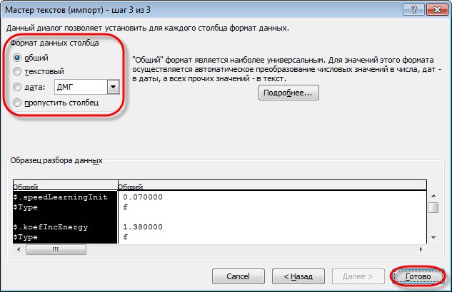{width="633" height="410"}

*Рис. 13.* Мастер текстов, шаг 3.

 

Импортируем данные на указанный лист MS Excel, начиная с указанной ячейки. Лучше импортировать данные на отдельный лист.

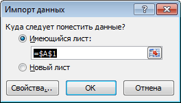{width="264" height="150"}

*Рис. 14.* Импорт данных на указанный лист.

 

При импорте данные разделились по отдельным ячейкам с нужным нам форматом. Теперь мы можем проанализировать эти данные каким угодно способом: произвести необходимые расчёты с помощью формул, вывести графики и диаграммы, строить сводные таблицы, применять отборы (фильтры) и сортировку. Благо MS Excel предоставляет исчерпывающие инструменты для такого анализа, в том числе с использованием программного кода на языке Visual Basic for Applications (VBA), т.е. так называемые макросы.

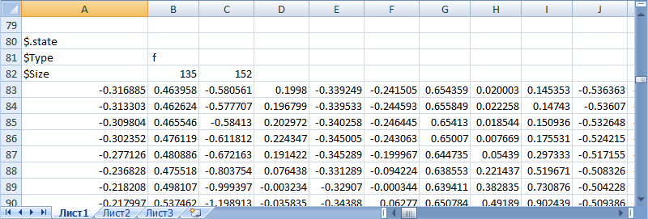{width="643" height="218"}

*Рис. 15.* Разделение данных после импорта.

 

**Загрузка данных в файл «Энергия обучения»**

{width="643" height="469"}

*Рис. 16.* Окно открытой книги «Энергия обучения.xlsx».

 

Для отображения информации по обучению нейросетевой модели на конкретной задаче был создан файл *«Энергия обучения.xlsx»*. Файл содержит следующие листы:

-   ***out\_trainbp*** – Импортируемые данные из соответствующего файла.
    
-   ***График (Aver)*** – График, на котором отображены средняя энергия обучающего и тестового множеств.
    
-   ***График (Max)*** – График, на котором отображены максимальная энергия обучающего и тестового множеств.
    
-   ***Скорость обучения*** – График, на котором отражается изменение скорости обучения.

Для импорта данных в файл и, соответственно, обновления графиков, нажимаем: *меню Данные – Обновить – Обновить все*. В появившемся окне выбираем соответствующий файл с обучающими данными.

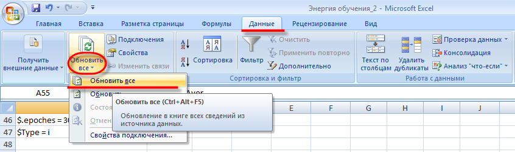{width="643" height="191"}

*Рис. 17.* Порядок импорта данных в файл «Энергия обучения.xlsx».

 

**Создание собственных задач**

Текущий проект можно доработать/расширить под свои задачи, решаемые с помощью полноснязных нейронных сетей. Для этого в соответствующих классах проекта были созданы виртуальные методы. Чтобы добавить новую задачу (новый класс задач) необходимо создать свой программный класс и наследовать все методы и поля из класса *NExamples*. Таким же образом можно переопределять класс обучения *TrainBP*, нейронной сети *INeuroNet* и т.д. Но здесь мы остановимся именно на переопределении класса задачи *NExamples*.

В проекте уже есть класс-наследник для задачи анализа временных рядов *Trade*. Данный класс называется *NTradeTg*. Аналогично этому классу можно создавать свои.

Для того, чтобы создать пользовательскую задачу в проекте, нужно переопределить следующие методы класса *NExamples*:

-   ***doShift***(***int shift, bool blShift)*** – Перемещение указателя примеров при множественном обучении. По большей части используется для временных последовательностей.
    
-   ***deinit()*** – Виртуальный деструктор класса отдельным методом.
    
-   ***prerun()*** – Предобработка данных для нейросетевой модели. Предобработка происходит над входами и выходами примеров нейросети. Данные могут обрабатываться в несколько этапов и храниться в соответствующих полях класса.
    
-   ***postrun()*** – Постобработка данных нейросетевой модели. Постобработка выполняется на расчётном выходном векторе примеров нейросети, после этого получаются готовые к применению и анализу данные.
    
-   ***saveECSV(DataECSV &dt, string &parent)*** – Метод для сериализации (сохранения) полей класса в файл формата ECSV.
    
-   ***loadECSV(DataECSV &dt, string &parent)*** – Метод для десериализации (загрузки) полей класса из файла формата ECSV.

Также не забудьте добавить код для функционирования вашего класса в следующие части программы:

-   В элемент формы *comboZad* добавьте название своей задачи.
    
-   Заголовочные файлы задачи в модуль *mainwindow.cpp*.
    
-   Метод *MainWindow::run* – Добавьте функционал при обучении/функционировании нейросети (обработчик нажатия на соответствующие кнопки).

{width="643" height="352"}

*Рис. 18.* Окно Qt Creator: создание класса пользовательской задачи.

 

**Приложение 1. Типы слоёв/нейронов и их функции активации.**

| **Тип**   | **Название**                               | **Функция**                                                  | **Производная**                                              |
| --------- | ------------------------------------------ | ------------------------------------------------------------ | ------------------------------------------------------------ |
| None      | Нет функции активации                      |                                                              |                                                              |
| Tanh      | Гиперболический тангенс                    | 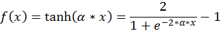                 | 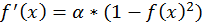                 |
| Softsign  | Функция SoftSign                           | 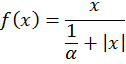                 | 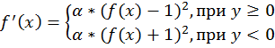                 |
| Arctg     | Арктангенс                                 | 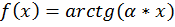                 | 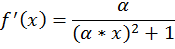                 |
| Linear    | Линейная функция                           | 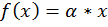                 | 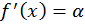                 |
| Step      | Пороговая функция                          | 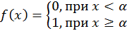                 | 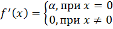                 |
| SoftStep  | Логистическая функция                      | 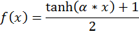                 | 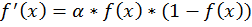                 |
| ReLU      | Rectified  linear unit (ReLU)              |                  | 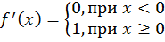                 |
| PReLU     | Parameteric  rectified linear unit (PReLU) | 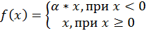                 |                  |
| ELU       | Exponential  linear unit (ELU)             | 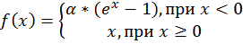                 | 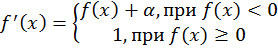                 |
| SoftPlus  | Функция SoftPlus                           | 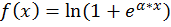                 | 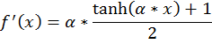                 |
| Sin       | Синус                                      | 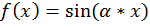                 | 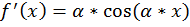                 |
| Sinc      | Функция Sinc                               | 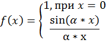                 | 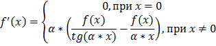                 |
| Gaussian  | Гаусс-функция                              | 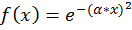                 | 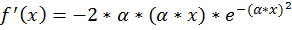                 |
| LinearInt | Линейная функция с целой частью            | 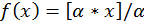                 | 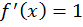                 |
| SoftMax   | Функция SoftMax                            |    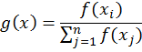 |                             Для Cross:   |
|           |                                            |                                                              |                                                              |

 

**Приложение 2. Алгоритм обучения: обратное распространение ошибки с регуляризацией и автоадаптацией скорости обучения.**

| Прямые формулы                               | Обратные формулы:                            |
| -------------------------------------------- | -------------------------------------------- |
|  |  |
|  |  |
|  |  |

 

Здесь приняты следующие обозначения:

- *speedLearning* – Текущий коэффициент обучения. Не стоит забывать, что этот коэффициент может меняться в процессе обучения.

- *inertia* – Коэффициент инерции (см. ниже).

- *N* – Количество обучающих примеров ().

- speedRegularization* – Коэффициент регуляризации.

-  – Изменение матрицы весов в k-ом слое в момент времени t.

-  – Матрица весов в k-ом слое в момент времени t.

-  – Изменение вектора смещений в k-ом слое в момент времени t.

-  – Вектор смещений в k-ом слое в момент времени t.

-  – Вектор ошибок обучения для k-ого слоя.

-  – Вектор выходов k-ого слоя.

-  – Производная функции активации.

-  – Производная целевой функции.

 

Алгоритм изменения коэффициента обучения работает по следующей формуле:

Здесь *curEnrg* – текущая энергия обучения, а *prevEnrg* – предыдущая энергия обучения. Причём скорость обучения *speedLearning* не может быть больше *speedLearningMax*.

 

**Приложение 3. Основные формулы.**

**Преобразование временных рядов**

Для цены:  

Для объёма: 

 

-   – Исходная цена/объём. 

-   - Входное/выходное значение для нейросети.

-  *koefTg* - Количество пунктов в цене. По умолчанию *koefTg = 10000*.

-  *koefPrice* - Коэффициент преобразования цены.

-  *koefVolume* - Коэффициент преобразования объёма.

Формула для расчёта энергии (ошибка примеров): 

-  *E* – Энергия множества примеров (средняя/максимальная).

-   – Изменение исходной выходной цены/объёма эталонного вектора примеров.

 

**Инициализация методом Нгуен-Видроу**

 ;  

 ;  

-  *n* – Количество нейронов в текущем слое

-  *m* – Количество нейронов в предыдущем слое.

 

**Виды целевых функций**

| **Тип** | **Название**              | **Функция**                                  | **Производная**                              |
| ------- | ------------------------- | -------------------------------------------- | -------------------------------------------- |
| None    | Нет целевой функции       |                                              |                                              |
| MSE     | Среднеквадратичная ошибка |  |  |
| Cross   | Кросс-энтропия            |  |  |

 

**Общая энергия примеров**

| **Тип** | **Название**              | **Средняя**                                  | **Максимальная**                             |
| ------- | ------------------------- | -------------------------------------------- | -------------------------------------------- |
| None    | Нет целевой функции       |                                              |                                              |
| MSE     | Среднеквадратичная ошибка |  |  |
| Cross   | Кросс-энтропия            |  |  |

 

**-регуляризация**

Где *K* – число слоёв в сети, *n* и *m* – количество нейронов в соответствующем слое.

*W* – это матрица весов; *B* – матрица смещений.

 

**Алгоритм обратного** **Dropout**

 

 – Нейроны текущего слоя (k-слой).

На этапе обучения:

 (см. Приложение 2)

На этапе тестирования:

-   – Веса текущего слоя.

-   - Смещения текущего слоя.

-   – Выход k-ого слоя.

